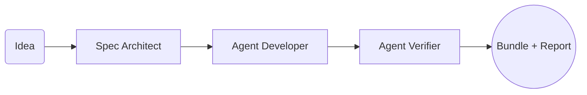
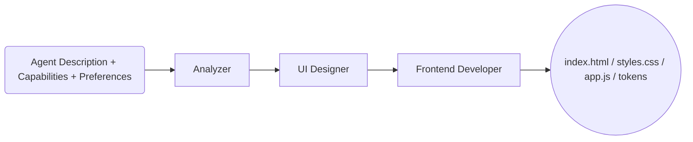

# AIA_Interface

AIA_Interface is a developer-friendly workspace that contains two complementary capabilities:

- AI Agent Generator (CrewAI-based) that turns plain-language ideas into runnable Python agents and verifies them.
- Dynamic UI/UX Generator (CrewAI-based) that produces tailored front-ends for different agents based on their capabilities and preferences.

This README is the central guide for new developers joining the project.

## Overview

- The codebase uses CrewAI agents orchestrated in pipelines. We rely on Google's Gemini models via CrewAI's LLM abstraction.
- The Agent Generator produces multi-file Python projects under `generated_agents/`.
- The UI/UX Generator produces front-end bundles (HTML/CSS/JS and tokens) under `generated_ui/`.
- Environment is managed via `.env` (loaded by `python-dotenv`).

### Key Components

- `ai_agent_generator/`
  - `agent_generator_crew.py`: Defines the agent-generation crew and tasks (specification → code generation → verification). Uses model `gemini/gemini-2.5-pro`.
  - `agent_maker_cli.py`: CLI to run the pipeline from a single command, harvest outputs, write files, and print a verification report. Includes robust JSON parsing (even when wrapped in Markdown fences) and fallbacks to ensure `README.md` and `requirements.txt` exist in the generated project.
  - `agent_schemas.py`: Pydantic models for inputs/outputs (idea, spec, file bundle, verification report).
- `ui_generator_cli.py`: CLI to generate UI bundles using the UI generator crew defined in `ui_generator_crew.py`.
- `README_*` files: Topic-specific docs for the two generators.

### High-level Pipelines

Agent Generator



UI/UX Generator



## Prerequisites

- Python 3.9+
- A `.env` file at the repository root containing:
  - `GEMINI_API_KEY` (required)
  - `SERPER_API_KEY` (optional; enables web search via Serper in some agents)

Example `.env`:

```
GEMINI_API_KEY=your_gemini_api_key
SERPER_API_KEY=your_serper_api_key  # optional
```

## Setup

Recommended one-time setup for this repo:

```bash
python3 -m venv .venv
source .venv/bin/activate
pip install -r requirements.txt
```

UI generator has some additional packages that are pinned in `requirements_ui_generator.txt`. Install them when you plan to run the UI generator CLI:

```bash
pip install -r requirements_ui_generator.txt
```

Alternatively, you can run the helper script:

```bash
python3 setup_cli.py
```

This installs a core set of packages and creates a starter `.env` if missing.

## Usage

### 1) Generate an Agent (code + verification)

Run the Agent Generator CLI from the repository root:

```bash
python -m ai_agent_generator.agent_maker_cli \
  --idea "An insurance claim triage agent that validates inputs, flags potential fraud risk, prioritizes severity, and routes cases; sends email notifications to stakeholders" \
  --name "Claim Triage Agent" \
  --output-dir ./generated_agents \
  --verify -v
```

What happens:

- The crew executes three tasks: specification → code generation → verification.
- The CLI robustly parses outputs (including JSON embedded in ```json fences), writes files into `generated_agents/<slug>/`, and prints a verification summary.
- The CLI also ensures `requirements.txt` and `README.md` exist in the generated project (it creates sensible fallbacks if absent), and lists all generated files.

Typical output layout for a generated agent:

```
generated_agents/<agent-slug>/
├── README.md
├── requirements.txt
├── src/claim_triage_agent/
│   ├── __init__.py
│   ├── agents.py
│   ├── tasks.py
│   ├── crew.py
│   └── main.py
└── tests/
    └── test_smoke.py
```

Run the generated agent (examples):

- If the entrypoint is a module under `src/`:

```bash
PYTHONPATH=src python -m claim_triage_agent.main data/sample_claim.json
```

- If the entrypoint is a file at project root:

```bash
python main.py
```

Run tests:

```bash
pytest -q
```

### 2) Generate a UI/UX bundle

Run the UI Generator CLI to create UI code based on an agent’s description, capabilities, and user preferences:

```bash
python3 ui_generator_cli.py \
  --agent-description "A travel planning assistant that helps users find destinations and create itineraries" \
  --agent-capabilities "Search destinations, create itineraries, recommend hotels and flights" \
  --theme dark \
  --color-scheme blue \
  --output-dir ./generated_ui
```

The CLI will:

- Kick off the UI generator crew.
- Save output files into `./generated_ui` (by default) including `index.html`, `styles.css`, `app.js`, and (optionally) `design_tokens.json`.
- If `index.html` is missing, it creates a simple `preview.html` for convenience.

### Environment Variables at Runtime

- `GEMINI_API_KEY` is always required.
- `SERPER_API_KEY` is optional. When present, some generated agents may initialize `SerperDevTool` for search. If not present, those tools and features are skipped gracefully.

## Repository Structure

Abridged tree of important files and directories:

```
AIA_Interface/
├── ai_agent_generator/
│   ├── agent_generator_crew.py
│   ├── agent_maker_cli.py
│   └── agent_schemas.py
├── ui_generator_cli.py
├── ui_generator_crew.py
├── requirements.txt
├── requirements_ui_generator.txt
├── setup_cli.py
├── README.md  # (this file)
├── README_AGENT_GENERATOR.md
├── README_CLI.md
├── README_UI_GENERATOR.md
├── generated_agents/  # outputs from the Agent Generator
└── generated_ui/      # outputs from the UI Generator
```

## Notable Implementation Details

- `ai_agent_generator/agent_maker_cli.py`
  - Functions like `_extract_json_candidates()`, `_maybe_bundle_from_any()`, and `_maybe_report_from_any()` make output harvesting resilient to formatting variations (e.g., JSON wrapped in code fences).
  - After writing the generated bundle to disk, the CLI ensures `requirements.txt` and `README.md` exist (creating fallbacks if missing), then prints a verification summary when `--verify` is used.
- `ai_agent_generator/agent_generator_crew.py`
  - Uses `LLM(model="gemini/gemini-2.5-pro")` for reliable provider selection.
  - The code-generation task explicitly requires `README.md` and `requirements.txt` be included in the returned bundle.
- `ui_generator_cli.py`
  - Exposes rich flags for themes, layout, and color schemes. It can log verbose progress and saves a preview when HTML is not returned.

## Git Hygiene

- Generated outputs live under `generated_agents/` and `generated_ui/`. You can choose to commit them or add them back to `.gitignore` if you prefer to keep the repo clean. In `.gitignore`, there are commented entries you can re-enable if needed.

## Troubleshooting

- **Missing API keys**: Ensure `.env` contains `GEMINI_API_KEY`. Add `SERPER_API_KEY` if you want search tools in certain agents.
- **Crew verification errors**: The Agent Verifier runs in a sandbox and installs/testing dependencies. If sandbox/network constraints surface, rely on the CLI’s written bundle on disk and run tests locally in your venv.
- **Import errors in generated agents**: Check `requirements.txt` inside the generated agent folder and ensure you’ve installed it in your environment. Also confirm you used `PYTHONPATH=src python -m <module>` when the entrypoint is under `src/`.
- **UI generation issues**: Use `--verbose` with `ui_generator_cli.py` to get more logs. Validate that the UI files generated have syntactically valid HTML/CSS/JS.

## Contributing

- Keep code typed and documented with clear docstrings.
- Avoid hardcoding secrets. Use `.env` and document required variables.
- When updating the generation prompts or schemas, ensure the Agent Generator still returns valid JSON without markdown wrappers and that verification passes.

## References

- Topic guides: `README_AGENT_GENERATOR.md`, `README_CLI.md`, `README_UI_GENERATOR.md`
- Requirements: `requirements.txt`, `requirements_ui_generator.txt`
- Entry CLIs: `ai_agent_generator/agent_maker_cli.py`, `ui_generator_cli.py`
